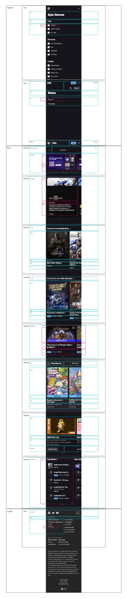
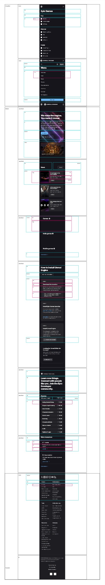
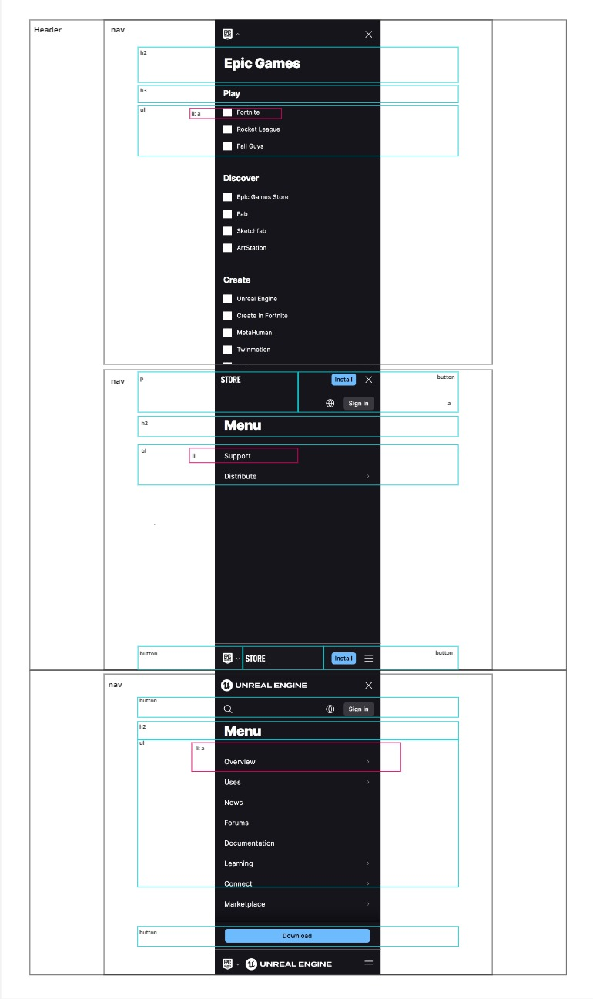

# Procesverslag
Markdown is een simpele manier om HTML te schrijven.  
Markdown cheat cheet: [Hulp bij het schrijven van Markdown](https://github.com/adam-p/markdown-here/wiki/Markdown-Cheatsheet).

Nb. De standaardstructuur en de spartaanse opmaak van de README.md zijn helemaal prima. Het gaat om de inhoud van je procesverslag. Besteedt de tijd voor pracht en praal aan je website.

Nb. Door *open* toe te voegen aan een *details* element kun je deze standaard open zetten. Fijn om dat steeds voor de relevante stuk(ken) te doen.

## Jij

  
uitwerken voor kick-off werkgroep

  ### Auteur:
  Keysha Manucan

  #### Je startniveau:
  Blauw

  #### Je focus:
  Responsive
 

## Je website

  
uitwerken voor kick-off werkgroep

  ### Je opdracht:
  https://store.epicgames.com/en-US/

  #### Screenshot(s) van de eerste pagina (small screen): 
  EpicGames Store  
  

  #### Screenshot(s) van de tweede pagina (small screen):
  EpicGames Unreal Engine  
  
 

## Toegankelijkheidstest 1/2 (week 1)

  
uitwerken na test in 2e werkgroep

  ### Bevindingen
  Lijst met je bevindingen die in de test naar voren kwamen:

  Screenreader test: 
  - "Back to top" knop in de footer zorgt ervoor dat je weer helemaal bovenaan de pagina komt, maar de screenreader leest niet vanaf het begin van de pagina maar weer verder waar die was bij de footer. 

  

  - Knoppen naar volgende en vorige werken op de slider, maar de screenreader vertelt niet of je op de volgende/vorige slide bent.

  

  WCAG checklist:
  - De HTML validator geeft heel veel errors over de pagina aan. 
  - De pagina voeldoet niet aan de media (video en audio) eisen.
  - De website steunt geen dark en light mode.
  - De video op de Unreal Engine pagina kan niet worden gepauseerd.
  - De website voldoet niet aan de prefers-reduced-motion media query. 

## Breakdownschets (week 1)

  
uitwerken na afloop 3e werkgroep

  ### de hele pagina: 
  
  De eerste pagina dat ik ga uitwerken: Epic Games Store.

  
  De tweede pagina dat ik ga uitwerken: Unreal Engine.

  ### dynamisch deel (bijv menu): 
  
  De menu van beide pagina's dat ik ga uitwerken.

  ### wellicht nog een dynamisch deel (bijv filter): 
  

## Voortgang 1 (week 2)

  
uitwerken voor 1e voortgang

  ### Stand van zaken
  hier dit ging goed & dit was lastig (neem ook screenshots op van delen van je website en code)

Vragen die ik wil stellen tijdens het voortgangsgesprek:
- Hoe open ik een andere tab/section op dezelfde pagina?
De eerste pagina dat ik wil uitwerken is de Homepagina van de site zelf. 
Op de homepagina zijn er drie verschillende categorieën waaruit je kan kiezen: Discover, Browse en News.
Elke tab laat verschillende soorten content zien, maar je blijft op dezelfde pagina.

Vraag aan docent:
Op mijn pagina is een download button te zien, moet ik dit ook laten werken?

  ### Agenda voor meeting
  samen met je groepje opstellen

  Diya:
  - Rating
  - Verschillende tabs openen op dezelfde pagina

  Thi: 
  - Lijnen naast de titel
  - Foto's veranderen wanneer je erover heen hovert

  Giulietta:
  - Bubbels komen uit de cursor
  - Veranderen van focus, van responsive naar surface plane

  Keysha: 
  - Verschillende tabs openen op dezelfde pagina
  - Tabel samenvoegen in carousel

  ### Verslag van meeting
  hier na afloop snel de uitkomsten van de meeting vastleggen

  - Section switch -> Hoeft niet te maken
  - Hover werkte niet -> Hover werkt niet op telefoon hover
  - Hover image, transition, opacity
  - Grid maken voor je lijst of in je lijst
  - h2::before{}
  - <h1></h1>

## Voortgang 2 (week 3)

  
uitwerken voor 2e voortgang

  ### Stand van zaken
  hier dit ging goed & dit was lastig (neem ook screenshots op van delen van je website en code)
  
  Tijdens de les liet ik aan de docent zien wat ik had. Ik liet allebei mijn carousellen zien en wat ik had gebruikt en gedaan om de carousel te maken. De docent vertelde mij dat het niet toegestaan was om een library te gebruiken, hierdoor moet ik op een andere manier uitzoeken hoe je een carousel moet maken zonder library. 

  
  

  Epic games heeft twee rijen aan navigatie op mobiel. De normale navigatie en de navigatie op de store pagina.

   

   Dit probeerde ik na te maken. Ik wilde grid hiervoor gebruiken. Ten eerste heb ik twee containers met behulp van div om de verschillende secties heen gezet, ik maakte gebruik van div omdat ik niet wist welke andere container ik moest gebruiken. 

   

  Maar dit zorgde ervoor dat het er chaotischer uitzag en wist ik niet helemaal hoe ik verder moest.

  

  Wat wil ik vragen tijdens het 2e voortgang gesprek:
  - Hoe verander je de kleur van een svg?
  - Hoe krijg ik de tweede nav balk?
  - Waarom is er aan de boven kant van mijn site een kleine pijl te zien?
    
  ### Agenda voor meeting
  samen met je groepje opstellen

  Diya:
  - Carousel maken
  - Problemen met nth-of-child

  Thi: 
  - Navigatie button op de juiste plek
  - Img size

  Giulietta:
  - Video op achtergrond goed krijgen
  - Classes en id's
  - Nav sticky maken

  Keysha: 
  - Hoe verander je de kleur van een svg?
  - Hoe krijg ik de tweede nav balk?
  - Waarom is er aan de boven kant van mijn site een kleine pijl te zien?

  ### Verslag van meeting
  hier na afloop snel de uitkomsten van de meeting vastleggen

  - Font downloaden op google: Reset refresh. Inspect -> Network -> Font
  - nth-of-type telt van 1t/m verder
  - Mag twee navs
  - Position: fixed, om elementen vast te zetten. top: 0, right: 0, left: 0,
  - Sluitmenu naar rechts
  - Justify-self: end;

  - Lelijke manier icoon veranderen: 
  filter: invert(1); van wit naar zwart of andersom

  - Mooie manier icoon veranderen:
  SVG openen in studio code, de link pakken en in je html zetten. SVG benoemen in de CSS en kleur veranden (fill: kleur;)

  ### Stand van zaken

  Het vorige probleem met de header positionering heb ik opgelost door alles in een grid te zetten en het goed te positioneren in de grid. 

  Momenteel heb ik twee problemen waar ik de oplossing niet voor weet. 
  Ik krijg een error op mijn code bij <button area-hidden="true">. Ik heb deze code vorig jaar bij mijn vorige website gebruikt en toen gaf die geen error maar nu wel. 

  

  Verder verschijnt de tekst dat in mijn nav zit in op de pagina, terwijl het "hidden" moet blijven. Als ik op de toolbar klik dan verschijnt hij niet. Waar zou dit aan kunnen liggen?

  
  

  Tijdens de les heb ik samen met de student assistente dit probleem opgelost. 

  We hebben de translate van de nav groter gemaakt. In plaats van -100 hebben we het naar -200 veranderd, zo was de tekst van de nav niet meer zichtbaar als de nav is ingeklapt. 

  Voor de error code met "area-hidden" hebben we "area-hidden" weggehaald uit mijn html. Zelfs zonder area-hidden werkte de nav nog steeds en was de code weg. 

  Ik had area-hidden gebruikt omdat ik dit vorig ook had gebruikt voor mijn vorige website en daar kreeg ik geen error code bij. 

## Toegankelijkheidstest 2/2 (week 4)

  
uitwerken na test in 9e werkgroep

  html validator error codes: 
  - H1 mag niet in een button element
  - SVG's errors en warnings
  - H6 mag niet in een ul element

  

  Screenreader:
  - Als je op tab drukt lees je alleen de linkjes, maar ik wil dat die door alle content heen gaat. 
  - Als je op H drukt gaat die door alle tekst (heading, p)
  - Screenreader shortcuts leren
  
  CAPS LOCK + SPATIE = Scan aan (dit wil je aan hebben staan)

    

  ### Bevindingen
  Lijst met je bevindingen die in de test naar voren kwamen (geef ook aan wat er verbeterd is):

  ### Stand van zaken

  
  
  Op de officiële website staan er drie verschillende categorieën naast elkaar als een soort tabel, dit wil recreëren. Ik dacht er eerst aan om alle categorieën in één section te plaatsen en voor elke categorie een aparte section te maken met daarin verschillende list items. 

  Dit leek me uiteindelijk geen goed idee, omdat er dan steeds een heading in een de ul element staat. Daarom ga ik proberen om alle drie de categorieën in drie verschillende sections te plaatsen, met daarin verschillende articles van elke game. 

## Voortgang 3 (week 4)

  
uitwerken voor 3e voortgang

  ### Stand van zaken
  hier dit ging goed & dit was lastig (neem ook screenshots op van delen van je website en code)

  ### Agenda voor meeting
  samen met je groepje opstellen

  | student 1      | student 2          | student 3    | student 4        |
  | ---            | ---                | ---          | ---              |
  | dit bespreken  | en dit             | en ik dit    | en dan ik dat    |
  | en dat ook nog | dit als er tijd is | nog een punt | dit wil ik zeker |
  | ...            | ...                | ...          | ...              |

  ### Verslag van meeting
  hier na afloop snel de uitkomsten van de meeting vastleggen

  - Gebruik display flex en @media (width > bijv 32em)
  - flex-shrink: 0;
  - scroll-snap-type: x mandatory; (uitzetten als scroll-behavior: smooth; aan staat)
  scroll-snap-align: center;
  overscroll-behaviour-x: contain;
  scroll-behavior: smooth;
  - id's linken aan de list items voor de carousel
  - list-style-type:""; gebruiken in plaats van list-style: none;
  - aria-label toevoegen aan de li bolletjes voor de carousel
  - zeg op de html scroll-behavior: smooth; en scroll-padding-top

  ### Stand van zaken
  In mijn header heb ik twee navs, de Epic Game store logo en de hamburger menu. De Epic Game store nav werkt en nu wil ik ook de hamburger menu werkend krijgen. Dit heb ik gedaan door hetzelfde soort js en css code toe te voegen voor de hamburger menu, de namen zijn natuurlijk anders. 

  Nadat ik de js code had toegevoegd voor de hamburgermenu werkte mijn logo menu niet meer. Met behulp van console.log heb ik gekeken of beide code's wel worden toegepast.

  Js code van de allebei de navs:

    // Epic store menu links
    let openButton = document.querySelector("header > button:first-of-type");
    let sluitButton = document.querySelector("header nav:first-of-type button");

    openButton.onclick = openMenu;
    sluitButton.onclick = sluitMenu;

    function openMenu () {
    let deNav = document.querySelector("header nav:first-of-type")
    deNav.classList.add("toonMenu");
    console.log(deNav.classList);
    }

    function sluitMenu () {
    let deNav = document.querySelector("header nav:first-of-type");
    deNav.classList.remove("toonMenu");
    }

    // Hamburger menu rechts
    let hamburgermenuOpen = document.querySelector("header > button:nth-of-type(3)");
    let hamburgermenuSluit = document.querySelector("header nav:nth-of-type(2) button:nth-of-type(2)");

    hamburgermenuOpen.onclick = openHamburgermenu;
    hamburgermenuSluit.onclick = sluitHamburgermenu;

    function openHamburgermenu() {
        let deHamburger = document.querySelector("header nav:nth-of-type(2)");
        deHamburger.classList.add("toonHamburger");
        console.log(deHamburger.classList);
    }

    function sluitHamburgermenu() {
        let deHamburger = document.querySelector("header nav:nth-of-type(2)");
        deHamburger.classList.remove("toonHamburger");
    }

      
   

  Volgens console.log wordt de js wel toegepast maar komen beide navs niet te voorschijn. 

    De CSS styling dat ik voor beide navs heb gebruikt:

    /*CSS styling voor beide nav's*/
    header nav:first-of-type,
    header nav:nth-of-type(2) {
    position: fixed;
    left: 0;
    right: 0;
    top: 0;
    bottom: 0;
    transform: translateY(-200%);
    transition: transform 0.3s;   
    background-color: var(--header-color);
    padding: 1.3em;
    z-index: 100;
    overflow-y: scroll;
    }

    nav.toonMenu {
      transform: translateY(0%);
    }

    nav.toonHamburger {
      transform: translateY(0%);
    }

  Het probleem lag aan de specifity en benoeming van de selector in de css
    
    header nav:first-of-type.toonMenu {
      transform: translateY(0);
    }
  
    header nav:nth-of-type(2).toonHamburger {
      transform: translateY(0);
    } 
  Was specifieker dan alleen .toonMenu of .toonHamburger  

## Eindgesprek (week 5)

  
uitwerken voor eindgesprek

  ### Je uitkomst - karakteristiek screenshots:
  

  ### Dit ging goed/Heb ik geleerd: 
  Korte omschrijving met plaatjes

  

  ### Dit was lastig/Is niet gelukt:
  Korte omschrijving met plaatjes

  

## Bronnenlijst

  
continu bijhouden terwijl je werkt

  Nb. Wees specifiek ('css-tricks' als bron is bijv. niet specifiek genoeg). 
  Nb. ChatGpT en andere AI horen er ook bij.
  Nb. Vermeld de bronnen ook in je code.

  1. bron 1
  2. bron 2
  3. ...

